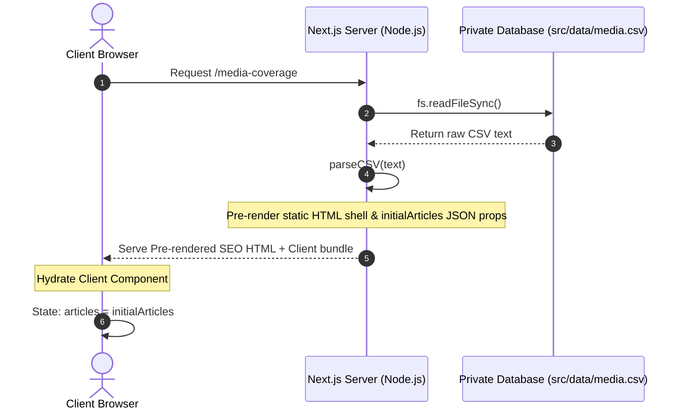

# Aap Sab Ki Awaaz (ASKA) NGO Portal

Aap Sab Ki Awaaz (ASKA) is a modern, premium Next.js platform designed to empower citizens by raising awareness of government welfare schemes, road safety practices, athletic support, and civic welfare campaigns.

---

## 🌟 Key Features

1. **In The Media (CSV-Driven Coverage):** Redesigned news feed dynamically parsed from a secure, internal CSV file. Supports swapping between **Card Grid** and **Editorial List** views with real-time text searches.
2. **Get Involved (Interactive Outreach):** High-usability coordination page allowing volunteers, mentors, and corporate sponsors to select their interest tracks and generate pre-filled email drafts directly to the PR team.
3. **Core Team ("The Head Honchos"):** Sleek roster showcasing the NGO leadership board. Employs CSS-gradient background avatars with initials to eliminate external image dependencies.
4. **Warm-Light Theme Design:** Curated elegant styling utilizing dark-neutral charcoal accents (`#111111`, `#1A1A1A`) and gold styling details (`#D4A853`, `#E8B931`) to align with standard NGO branding.
5. **Interactive Privacy Masking:** Standardized masking for phone numbers and email details (masked as `xxx` by default, revealed dynamically on mouse hover) to prevent scraping.
6. **Fully Accessible (A11y):** Built-in text resizing widget and keyboard-navigable focus rings.

---

## 🏗️ Technical Architecture & Data Flows

### 1. Hybrid Server-Client Render Cycle
ASKA implements Next.js App Router static pre-rendering (SSR) combined with responsive Client Component hydration:



### 2. File Organization & Navigation
```bash
aapsabkiawaaz/
├── public/                 # Static Public Assets
│   └── images/             # Local images (helmets, medical camps, sports, etc.)
├── src/
│   ├── app/                # Next.js App Router Pages
│   │   ├── core-team/      # Core Team roster route
│   │   ├── get-involved/   # Get Involved contact template route
│   │   ├── media-coverage/ # Server-side CSV loading route
│   │   ├── globals.css     # Global CSS variables & Tailwind config
│   │   ├── layout.tsx      # Root layout (Header, Footer, A11y widget)
│   │   └── page.tsx        # Homepage layout with contact details
│   ├── components/         # Interactive React Client Components ("use client")
│   │   ├── Header.tsx      # Sticky warm-glass header & mobile slider
│   │   ├── Footer.tsx      # Multi-column white-on-dark footer
│   │   ├── AccessibilityWidget.tsx  # Dynamic font sizing controls
│   │   ├── MediaCoverageClient.tsx  # Grid/List toggles & filters
│   │   └── GetInvolvedClient.tsx    # Volunteer details & email generator
│   ├── data/
│   │   └── media.csv       # Private, internal-only CSV database file
│   └── utils/
│       └── csvParser.ts    # Secure CSV parsing & stringifying helpers
├── next.config.ts          # Next.js configuration
├── tailwind.config.ts      # Tailwind configuration rules
└── package.json            # Project dependencies and script declarations
```

---

## 💻 Local Setup & Installation

Follow these steps to configure and run the project locally on your machine:

### 1. Prerequisites
Ensure you have **Node.js (v18.x or later)** and **npm** installed:
```bash
node --version
npm --version
```

### 2. Clone the Repository & Install Dependencies
Open your shell terminal in the project directory and install the Node packages:
```bash
npm install
```

### 3. Start the Local Development Server
Launch the compiler server locally:
```bash
npm run dev
```
Open your browser and navigate to: **[http://localhost:3000](http://localhost:3000)**.

### 4. Build for Production
To verify that everything typechecks and pre-renders successfully:
```bash
npm run build
```

---

## 📝 Updating Content (For Non-Technical Users)

### 1. Adding/Editing Media News Coverage
You do **not** need to touch React codebase files to add or edit news coverage items. Instead:
1. Open the file **`src/data/media.csv`** in any spreadsheet application (like Microsoft Excel or Google Sheets) or a plain text editor.
2. Add a new row at the bottom matching these headers:
   * **`image_src`**: The filename of the image stored inside `public/images/` (e.g. `my-new-event.jpg`).
   * **`title`**: The headline for the news item.
   * **`description`**: A detailed excerpt or text body.
   * **`source`**: The publishing entity (e.g. `The Hindu / Sakshi`).
   * **`date`**: The date text (e.g. `July 15, 2026`).
   * **`url`**: The external link url (e.g. `https://example.com/article`).
3. Save the file and restart the development server or run `npm run build` to see the changes take effect.
